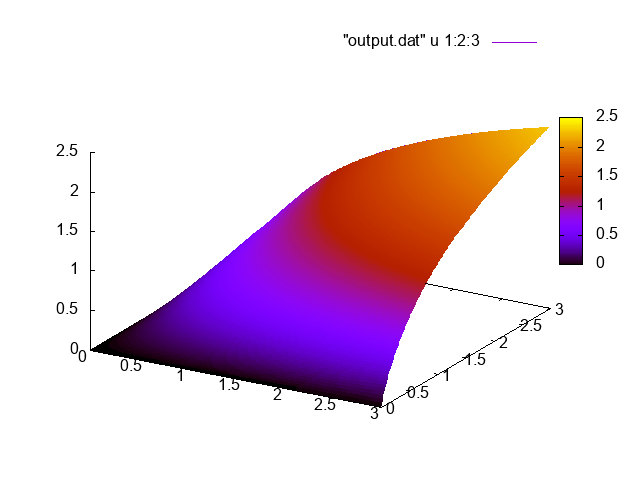

# Практическое задание 2
Галуза Дмитрий, группа 624, вариант 2

[TOC]

## Математическая постановка задачи
**Варинат 2**: набор данных 1, сетка равномерная, максимум-норма
В прямоугольной области $\prod = [0, 2] \times [0, 2]$ необходимо найти дважды гладкую функцию $u = u(x,y)$, удовлетворяющую дифференциальному уравнению
$$-\Delta u(x,y) = (x^2 + y^2) \sin(xy)$$
и граничному условию
$$u(x,y) = ln(1 + xy)$$
во всех точках $(x, y)$ прямоугольника.

## Численный метод решения задачи

Для решения задачи был использован метод `скорейшего спуска` (на первой итерации) и метод `сопряжённых градиентов` (на последующих итерациях) на равномерной сетке при заданном количестве точек $N_1$ по оси $x$ и $N_2$ по оси $y$:
$$\overline{\omega} = {(x_i, y_j),  \quad i = 0, 1, 2, \ldots, N_1,  \quad j = 0,1,2, \ldots N_2}$$
$$x_i = 2 \frac{i}{N_1 - 1} - 2 \left\(1 - \frac{i}{N_1 - 1}\right\) \quad y_j = 2 \frac{j}{N_2 - 1} - 2 \left\(1 - \frac{j}{N_2 - 1}\right\)$$.
Опишем условие остановки итерационного процесса:
  - Пусть $P(n) = \[ p(n) \]$ --- приближённое решение, полученное на итерации $n$.
  - Максимум норма:
$$\|P\| = \max_{0<i<N_1, \quad 0<j<N_2}|p_{ij}|, \quad p = \[ p_{ij}\]$$
  - Итерационный процесс останавливается, как только:
$$\|P(n) - P(n - 1)\| < \varepsilon, \quad \varepsilon = 0.0001$$.

## Описание программной реализации
Программная реализация была выполнена на языке `C++`.

Для распараллеливания решения задачи на разных вычислительных узлах использовалась библиотека `MPI`. Для распараллеливания в рамках одного вычислительного узла (содержащего несколько вычислительных ядер) были использованы технологии `OpenMP`.

Исходный код программной реализации является открытым и доступен на GitHub: https://github.com/allocator64/superprak.

#### Сборка
Для компиляции программы используется `Makefile`.
Поддерживается сборка с включенным `OPENMP` и без него, бинарные файлы называются `task2_omp` и `task2_np_omp` соответственно.
Для сборки с `OPENMP` нужно выставить переменную окружения `OPENMP`.

    make
    OPENMP=1 make

#### Запуск

Запуск программы осуществляется следующей командой:

    $ ./task2_no_omp
    Usage: ./task2_no_omp x_points_num y_points_num [path/to/output.dat]

Параметры:

 + `x_points_num y_points_num` --- размеры сетки
 + `path/to/output.dat` --- путь для выходного файла с точками (для построение графиков)

Постановка заданий для BlueGine описана в скрипте run_bluegine.sh

#### Файлы

###### statement
Программный код разбит на несколько файлов, классов и пространств имен.
В пространстве имен `statement` определены значения, соответственно варианту, а именно размер прямоугольника, дифферинциальная функция и граничное условие.
###### state
В пространосво имен `state` вынесены зачения "состояния" для каждой ноды, такие как:

 + номер ноды
 + размеры процессорной сетки
 + координаты текущей ноды в сетке процессоров
 + размеры обратываемого окна
###### matrix
Класс `Matrix` представляет интерфейс матрицы, основанный на `std::vector<double>`, хранящий длину\ширину матрицы и предоставляюший доступ к ячейкам по точке $(x,y)$.
###### range_manager
Класс `RangeManager` осуществляет отображение обрабатываемого окна для текущей ноды на соответствующее окно исходного прямоугльника.
###### utils
Пространство имен `utils` содержит вспомогательные функции для расчета координат, работы с процессорной сеткой и заполнения части полей из `state`
###### math
В пространство имен `math` вынесены все математические функции, используемые в задаче. А именно:

 + $\Delta$
 + $R$
 + $\tau$
 + $P$
 + $\alpha$
 + $G$
При сборке с дириктивой препроцессора `USE_OPENMP` в функции из `math` добавляются дириктивы компилятора `omp parallel for`
###### logger
В файл `logger` выенесены макросы препроцессора для упрощения вывода информации на стандартный поток вывода, добавляющие имя файла и номер строки из которой был вызов лога.
###### geo_primitives
В этот файл вынесены классы `Range` и `Rectangle` которые определяют отрезок и прямоугольник соответственно. Первый используется в классе `RangeMapper` и в классе `Rectangle`. `Rectangle` используется при задании начального прямоугольника.
###### mpi
Пространство имен `mpi` содержит обертки для `MPI` вызовов. Все `MPI` вызовы происходят через макрос препроцессора `CALL_MPI`, который осуществляет проверку кода возврата из `MPI` вызова и бросает исключение `std::runtime_error` в случае ошибки.
###### communications
В Пространство имен `communications` выделены классы и функции, отвечающие за отправку и прием граничных значений для каждой ноды.
###### solution
 + `solution_simple` --- линейная версия алгоритма
 + `solution_super` --- параллельная версия алгоритма

## Результаты расчётов

| Кол-во процессов | Размер сетки | OpenMP | Время решения, сек | Ускорение
| -- | -- | -- | -- | -- |
| 1   | 1000x1000 | OpenMP=1 | 1716.28   |        |
| 128 | 1000x1000 | OpenMP=1 | 14.20     | 120.86 |
| 256 | 1000x1000 | OpenMP=1 | 7.95      | 215.88 |
| 512 | 1000x1000 | OpenMP=1 | 4.91      | 349.55 |
| 1   | 2000x2000 | OpenMP=1 | ~17281.23 |        |
| 128 | 2000x2000 | OpenMP=1 | 101.46    | 170.33 |
| 256 | 2000x2000 | OpenMP=1 | 52.34     | 330.17 |
| 512 | 2000x2000 | OpenMP=1 | 28.26     | 611.51 |
| 1   | 1000x1000 | OpenMP=3 | 561.63    |        |
| 128 | 1000x1000 | OpenMP=3 | 6.61      | 84.97  |
| 256 | 1000x1000 | OpenMP=3 | 4.36      | 128.81 |
| 512 | 1000x1000 | OpenMP=3 | 3.27      | 171.75 |
| 1   | 2000x2000 | OpenMP=3 | 4504.32   |        |
| 128 | 2000x2000 | OpenMP=3 | 41.54     | 108.43 |
| 256 | 2000x2000 | OpenMP=3 | 21.94     | 205.30 |
| 512 | 2000x2000 | OpenMP=3 | 13.18     | 341.75 |

## Визуализация решения
Приближенное решение, полученное в результате задачи:

Точное решение (фукция фи):
")
